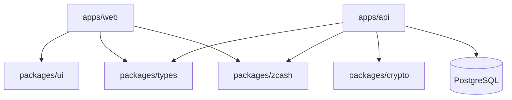

# Veil

Veil is a privacy-focused creator patronage platform.

## Architecture



## Setup

1. Install dependencies:
   ```bash
   pnpm install
   ```

2. Set up environment variables:
   Copy `.env.example` to `.env` in `apps/web` and `apps/api`.

3. Run development server:
   ```bash
   pnpm dev
   ```

## Structure

- `apps/web`: Next.js 14 App Router application
- `apps/api`: Express backend API
- `packages/ui`: Shared React components
- `packages/zcash`: Zcash integration utilities
- `packages/crypto`: Encryption utilities
- `packages/types`: Shared TypeScript types
- `packages/config`: Shared configurations
